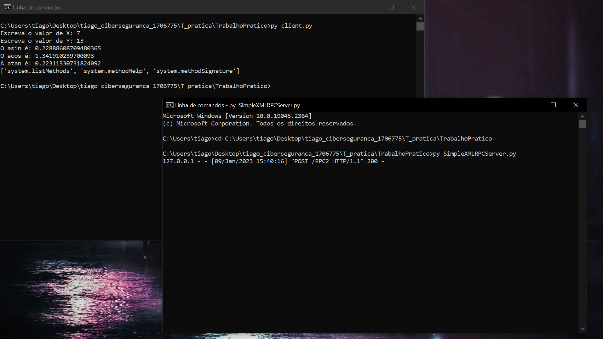

# tiago_ciberseguranca_1706775

Nome: Tiago Rocha Martins  Nº1706775

Curso: Ciberseguranca

Disciplina: Sistemas Distribuídos

# Relatório do Trabalho Prático
# Sistemas Distribuídos

## Nome do Trabalho: Função trigonométrica inversa

## Aluno: Tiago Martins, Número:1706775,
## Github:https://github.com/TiagoRochaMartins, 
## Email:tiagorochamartins19@gmail.com
## No GITHUB o código do servidor e do client encontram-se na pasta T_pratica/TrabalhoPratico

## 1.Descrição do Trabalho
Este trabalho consiste na criação de uma função no servidor: implementar função inv_trignometria(x,y) que calcula os valores da função arccos, arcsin ,arctg 
indicada em x com argumento y (exemplo arccos(y)) e retorna ao cliente o resultado. 
cliente envia a função a calcular e o argumento para o servidor retornar o seu valor. 

## 2.Função implementada	
  //Esta é a função que foi implementada no servidor
  
def inv_trignometria(x,y):

    
return x + y
 

## 3.Servidor	

from xmlrpc.server import SimpleXMLRPCServer

from xmlrpc.server import SimpleXMLRPCRequestHandler

//Nas duas linhas em baixo vamos restringir a um caminho específico

class RequestHandler(SimpleXMLRPCRequestHandler):

    
rpc_paths = ('/RPC2',)

//Nas duas linhas de baixo vamos definir a função

def inv_trignometria(x,y):

   
return x + y
    

//Nas três linhas em baixo vamos criar o servidor

with SimpleXMLRPCServer(('localhost', 8000),

                       
requestHandler=RequestHandler) as server:

    
server.register_introspection_functions()

//A última linha vai executar o loop principal do servidor
    
server.serve_forever()

## 4.Client	

import xmlrpc.client

s = xmlrpc.client.ServerProxy('http://localhost:8000')

//Na linha de baixo a partir do módulo math vamos importar várias funções.

from math import radians, asin, acos, atan

//Nas duas linhas abaixo vamos ler o X e o Y.

ângulo = float(input('Escreva o valor de X: '))

ângulo = float(input('Escreva o valor de Y: '))

// Na linha em baixo o ângulo que eu escrevi vai ser convertido para radianos e calcular o asin

seno = asin(radians(ângulo))

// Na linha em baixo vai ser o output

print('O asin é:'. format(ângulo, seno),seno)

// Na linha em baixo o ângulo que eu escrevi vai ser convertido para radianos e calcular o acos

cosseno = acos(radians(ângulo))

// Na linha em baixo vai ser o output

print('O acos é:'. format(ângulo, cosseno),cosseno)

// Na linha em baixo o ângulo que eu escrevi vai ser convertido para radianos e calcular a atan

tangente = atan(radians(ângulo))

// Na linha em baixo vai ser o output

print('A atan é:'. format(ângulo, tangente),tangente)

print(s.system.listMethods())

## 5.Funcionamento do trabalho	
Como é possível ver na imagem em baixo podemos ver o client e o servidor a funcionarem

## 6.Conclusão

Neste trabalho o que foi feito foi criar um cliente e um servidor.

No cliente criei um módulo chamado math e criei as funções radians, asin, acos, atan.
Criei duas linhas em que vai ser pedido o valor de X e de Y.
Nas linhas de baixo basicamente o ângulo vai ser convertido para radianos e calcular o asin, acos e atan.
E na outra linha vai sair o respetivo output do cálculo.

No servidor resumidamente defini uma função e criei um servidor.

Resumidamente o cliente vai enviar uma função a calcular e o argumento para o servidor retornar o seu valor.

branch auxiliar

